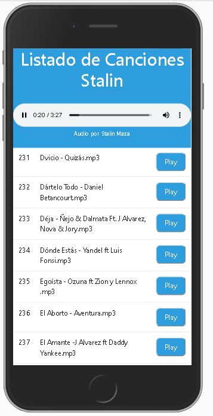

# Reproductor Música Muy Simple

### Ejercicio realizado con PHP y Javascript para tener un mini reproductor de música básico

- Levantar el Servidor de Archivos en la ubicación de las canciones, por ejemplo con live server "live-server --port=3200"

- Configurar la ruta de las canciones en el archivo config.php y la URL del live server en el main.js

- Disfruta del mini reproductor web

## Imagenes

## Autor
> Stalin Maza